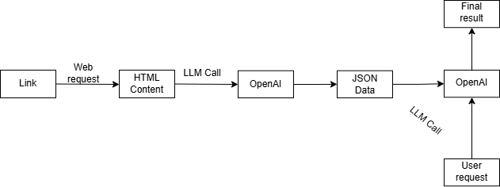

# Data Extraction Agent

A two-agent system that extracts and analyzes product information from e-commerce websites.



## How It Works

### Agent 1: Data Extractor
- Takes HTML content from a webpage
- Extracts product information (name, price, description, etc.)
- Outputs data as JSON
```python
[
  {
    "name": "Product Name",
    "price": "$99.99",
    "description": "Product description",
    "link": "https://...",
    "specifications": {...}
  }
]
```

### Agent 2: Product Recommender
- Reads the JSON data from Agent 1
- Takes user requirements as input
- Recommends best matching product
```python
{
  "recommended_product": {...},
  "reason": "Why this product was chosen",
  "price_numeric": 99.99
}
```

## Technical Details
- Uses OpenAI GPT-4.1-nano model
- Makes 2 LLM calls (one per agent)
- Requires OpenAI API key